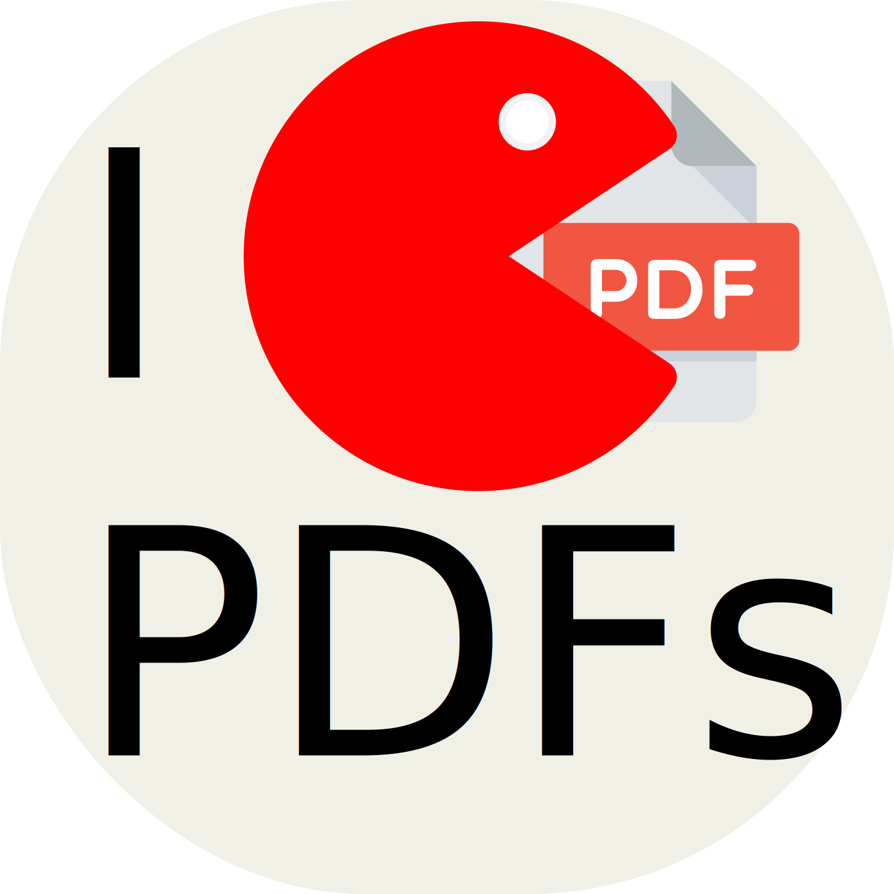

# I ate PDFs

A modern, user-friendly GTK4 application for manipulating PDF files on Linux. With an intuitive drag-and-drop interface, I ate PDFs makes it easy to merge, compress, split, and reorder PDF documents.



## Features

### Merge PDFs
- Drag and drop multiple PDF files to merge them into a single document
- Reorder files before merging with intuitive drag-and-drop
- Live preview thumbnails of each PDF's first page

### Compress PDFs
- Reduce PDF file sizes using Ghostscript
- Choose from multiple quality presets:
  - **screen** (72 dpi) - Lowest quality, smallest file size
  - **ebook** (150 dpi) - Good quality for digital reading
  - **printer** (300 dpi) - High quality for printing
  - **prepress** (300 dpi) - Highest quality, preserves color

### Split PDFs
- Extract individual pages from any PDF
- Each page is saved as a separate PDF file
- Automatic naming with page numbers

### Reorder & Delete Pages
- Visual page reordering with drag-and-drop
- Preview thumbnails for all pages
- Mark pages for deletion before saving
- Save the reordered PDF as a new file

## Installation

### Dependencies

#### System Requirements
- Python 3.6 or higher
- GTK 4
- Libadwaita
- PyGObject
- Ghostscript (for compression)
- poppler-utils (for PDF rendering)

#### Fedora/RHEL
```bash
dnf copr enable juliengrdn/IatePDFs
sudo dnf install iatepdfs
```


### Running the Application

```bash
python3 IAtePDFs.py
```

Or make it executable:

```bash
chmod +x IAtePDFs.py
./IAtePDFs.py
```

## Usage

### Getting Started

1. **Launch the application**: Run `python3 IAtePDFs.py`
2. **Add PDF files**: 
   - Drag and drop PDF files onto the window, or
   - Click "Browse Files" to select PDFs from your file system

### Merging PDFs

1. Add multiple PDF files to the list (left panel)
2. Reorder them by dragging rows up or down
3. Click "Merge All PDFs" to create a single combined document
4. Choose the output location and filename

### Compressing PDFs

1. Select a PDF file from the list
2. Choose your desired quality preset from the dropdown
3. Click "Compress" 
4. Select the output location for the compressed file

### Splitting PDFs

1. Select a PDF file from the list
2. Click "Split"
3. Choose the output folder where individual pages will be saved
4. Pages will be saved as `filename_page_1.pdf`, `filename_page_2.pdf`, etc.

### Reordering Pages

1. Select a PDF file from the list
2. Wait for page thumbnails to load in the right panel
3. Drag and drop page thumbnails to reorder them
4. Click the delete button on any page to mark it for removal
5. Click "Save Reordered" to create a new PDF with your changes

## Technical Details

### Built With

- **GTK 4**: Modern toolkit for creating graphical user interfaces
- **Libadwaita**: GNOME's library for adaptive UI components
- **PyGObject**: Python bindings for GTK
- **pypdf**: Pure-Python PDF manipulation library
- **pdf2image**: Wrapper around pdftoppm and pdftocairo for rendering PDF pages
- **Ghostscript**: PostScript interpreter for PDF compression

## Configuration

The application stores no configuration files and maintains no persistent state between sessions. All operations work directly on the files you provide.

## Troubleshooting

### "Ghostscript (gs) is not installed"
Install Ghostscript using your package manager (see Dependencies section).

### "Cannot generate preview"
Ensure `poppler-utils` is installed. The application will still function, but without thumbnails.

### "Cannot load encrypted PDF"
The application does not support password-protected PDFs. Remove the password protection first using another tool.

### Import errors
Make sure all Python dependencies are installed:
```bash
pip install pypdf pdf2image
```

## License

This project is licensed under the MIT License - see the [LICENSE](LICENSE) file for details.

## Acknowledgments

- GTK and GNOME teams for the excellent toolkit and design guidelines
- PyGObject maintainers for Python bindings
- pypdf and pdf2image library authors
- Ghostscript developers

